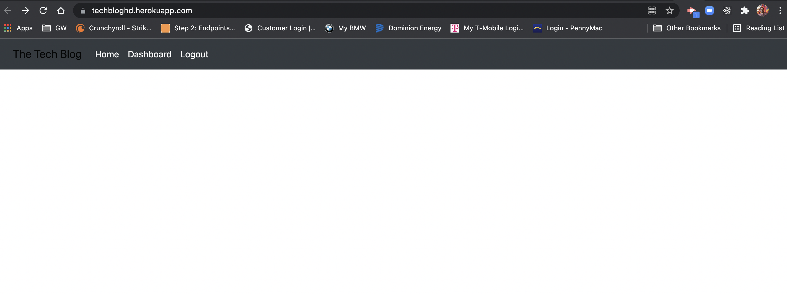

# techblog

## Description

  AS A developer who writes about tech
I WANT a CMS-style blog site
SO THAT I can publish articles, blog posts, and my thoughts and opinions
  ## Table of Contents
  
  
  * [Installation](#installation)
  * [Usage](#usage)
  
  
  ## Installation

  - Please navigate to project folder and open Terminal/Gitbash, run npm install to retrieve the necessary libraries, and Run the following node server.js locally

  ## Technology

  - HTML, CSS, JavaScript, MySql, sequilize

  Deployed URL: https://techbloghd.herokuapp.com/